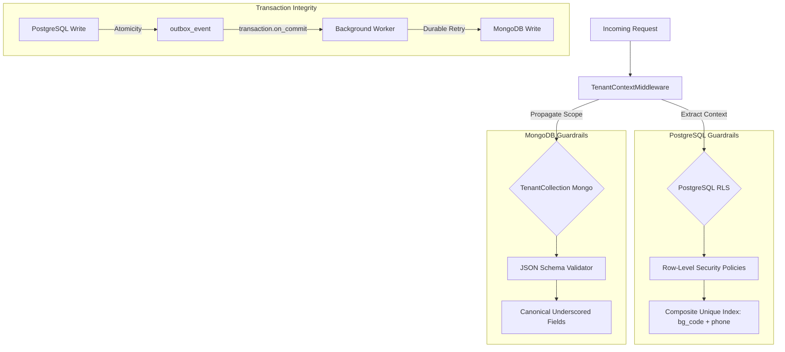

# Architectural Alignment Audit: Constitution vs. Board Plans

**Status:** Under Review (Pending Board Approval)  
**Date:** 2026-05-17  
**Author:** Antigravity (Principal AI Architect)  
**Target:** KungOS Platform Primitives, Identity, & Tenancy  
**Tags:** [architecture, security, audit, database, rbac]

---

## 1. Executive Summary

This audit evaluates the alignment between the four core **Architectural Constitution** documents (`identity_layer.md`, `multi_tenancy.md`, `platform_primitives.md`, `rbac_system.md`) and the Board's high-level directives outlined in the **KUNGOS_INTEGRATION_PLAN.md** and **KungOS_Identity_Design.md**.

### Verdict
The Architectural Constitution is in **high general alignment** with the Board's vision. It successfully translates the strategic goals of unifying the Kuro Gaming and Rebellion cafe ecosystems into solid, modular software engineering primitives. 

However, a deep cross-reference of the codebase, target schemas, and operational constraints has exposed **three critical architectural contradictions and design vulnerabilities**. Left unaddressed, these gaps will cause cross-tenant data leaks, operational blockages for walk-in cafe customers, and data drift between PostgreSQL and MongoDB. 

This document details these gaps and provides an actionable blueprint for establishing a **foolproof system** through database constraints, middleware guardrails, and transaction guarantees.

---

## 2. Alignment Matrix & Gap Analysis

The table below outlines how well the specific constitutional designs align with the spirit of the Board's plans:

| Constitutional Focus | Source Document | Plan / Board Directive | Alignment | Status & Gap Identified |
| :--- | :--- | :--- | :--- | :--- |
| **Core Identity** | `identity_layer.md` | `KungOS_Identity_Design.md` | **90% (High)** | **Critical Conflict on Wallet Binding:** The plan binds wallets to `CustomUser`, whereas the constitution binds them to `users_identity`. |
| **Multi-Tenancy** | `multi_tenancy.md` | `KUNGOS_INTEGRATION_PLAN.md` | **85% (High)** | **Naming Inconsistency (Security Risk):** MongoDB uses legacy `bgcode`/`division`, while the PG and RLS standard uses `bg_code`/`div_code`. |
| **Platform Primitives** | `platform_primitives.md` | `KUNGOS_INTEGRATION_PLAN.md` | **75% (Medium)** | **Dual-Write Consistency Gap:** F&B operational writes to MongoDB bypass the Outbox pattern during transaction-sensitive PG operations (e.g., `session_end`). |
| **Access Control (RBAC)** | `rbac_system.md` | `KungOS_Consolidated_Reference.md` | **100% (Perfect)** | Fully aligned. Legacy flat `Accesslevel` table is deprecated in favor of a tenant-scoped, cascading permission engine. |

---

## 3. The Three Critical Architectural Gaps

### Gap 1: The Wallet Binding Conflict (CustomUser vs. Identity)
* **The Plan (`KungOS_Identity_Design.md` §2.3, §4.1):** States that `CafeWallet.customer` is a Foreign Key referencing `users_customuser` (auth-bound, not identity-bound).
* **The Constitution (`identity_layer.md` §Platform Alignment):** Mandates that the wallet links directly to the core `users_identity` table instead of `CustomUser` or a polymorphic relation.
* **The Operational Impact:** In a GGleap-style gaming cafe, a **walk-in customer** does not have password credentials or a registered login account. Therefore, they **do not** have a `CustomUser` record, but they **must** have an active `users_identity` record (with `user = NULL`) to track their session. If the wallet is bound to `CustomUser`, walk-ins cannot have wallets or prepaid balances, which completely breaks the core cafe billing workflow.
* **The Foolproof Resolution:** The Constitution's design is correct. The wallet **must** link directly to `users_identity.identity_id`. This allows both registered users (with credentials) and walk-in customers (unregistered) to utilize wallets seamlessly.

### Gap 2: The MongoDB Naming Skew (bgcode vs. bg_code)
* **The Plan / Legacy Codebase:** MongoDB collections utilize the legacy field names `bgcode` and `division` for tenant scoping.
* **The Constitution (`multi_tenancy.md` §Tenant Hierarchy):** Defines canonical naming across all databases using underscored suffixes: `bg_code`, `div_code`, and `branch_code`.
* **The Security Risk:** Inconsistent field names represent a massive security threat. If a developer uses the new platform's `TenantCollection` wrapper but queries a legacy MongoDB collection that contains `bgcode` instead of `bg_code`, the tenant isolation filter will fail or fail silently, leading to **cross-tenant data exposure**.
* **The Foolproof Resolution:** Phase 5 of the Integration Plan must enforce a strict, complete MongoDB database migration (Phase 5.7) that renames `bgcode` $\rightarrow$ `bg_code` and `division` $\rightarrow$ `div_code` in every document, co-locating with mandatory JSON Schema validations.

### Gap 3: The Concurrency / Dual-Write Vulnerability
* **The Plan (`KUNGOS_INTEGRATION_PLAN.md` Phase 2A/2B):** During cafe session termination (`session_end()`), the application ends the PostgreSQL billing session and writes F&B charges to the MongoDB-backed F&B gateway (`OrderGateway`).
* **The Constitution (`platform_primitives.md` §Outbox Pattern):** Strongly states: *"Cross-store consistency patterns must use the Outbox pattern. Direct dual-writes have no retry mechanism and lead to data drift."*
* **The Data Drift Risk:** The PG operations inside `session_end` are wrapped in `transaction.atomic()`, but the F&B MongoDB write occurs over a network call through PyMongo. If the PG transaction succeeds but the network call to MongoDB fails (or vice versa), the system enters a split-brain state where time is billed but food orders are dropped or duplicated.
* **The Foolproof Resolution:** The F&B operational adapter (`OrderGateway`) must publish an outbox event (`order.placed`) using the `plat/outbox/` primitive. This guarantees that the MongoDB write is executed if and only if the PG transaction is committed, and automatically retries if MongoDB experiences transient downtime.

---

## 4. Blueprint for a Foolproof System

To ensure that the system is completely "foolproof" and cannot be broken by subsequent development or human error, we must implement automated guardrails at three levels: Database, Application, and CI/CD.



### 4.1 Database-Level Guardrails

1. **Foreign Key Integrity:**
   Enforce relational foreign keys in PostgreSQL that prevent orphaned extensions:
   ```sql
   ALTER TABLE users_employee 
     ADD CONSTRAINT fk_employee_identity 
     FOREIGN KEY (identity_id) REFERENCES users_identity(identity_id) ON DELETE CASCADE;
   ```
2. **Composite Tenant Constraints:**
   To guarantee E.164 phone uniqueness within a single Business Group while allowing portability, we must enforce a composite unique index:
   ```sql
   CREATE UNIQUE INDEX uq_identity_tenant_phone 
     ON users_identity (bg_code, phone);
   ```
3. **MongoDB JSON Schema Enforcement:**
   Add a strict JSON schema validation to all MongoDB collections that rejects any document missing canonical tenant codes or containing legacy non-underscored fields:
   ```javascript
   db.createCollection("kgorders", {
      validator: {
         $jsonSchema: {
            bsonType: "object",
            required: [ "bg_code", "div_code", "orderid" ],
            properties: {
               bg_code: { bsonType: "string", pattern: "^[A-Z]{4}\\d{4}$" },
               div_code: { bsonType: "string", pattern: "^[A-Z]{4}\\d{4}_\\d{3}$" }
            },
            additionalProperties: true
         }
      }
   });
   ```

### 4.2 Application-Level Guardrails

1. **Enforce the `TenantCollection` Proxy:**
   To make direct, tenant-less PyMongo writes impossible, all views must be banned from importing `pymongo.MongoClient` directly. They must route through the `get_collection()` helper which returns a `TenantCollection` instance:
   ```python
   # plat/tenant/collection.py
   class TenantCollection:
       def __init__(self, collection, context):
           self._collection = collection
           self._context = context

       def find(self, filter, *args, **kwargs):
           if not self._context.bg_code:
               raise TenantContextMissing("Queries are blocked without an active bg_code context.")
           filter = filter.copy()
           filter['bg_code'] = self._context.bg_code
           return self._collection.find(filter, *args, **kwargs)
   ```
2. **PG Transaction Commits for MongoDB Writes:**
   All secondary database writes (MongoDB) triggered by relational events must be executed via `transaction.on_commit` to eliminate dual-write splits:
   ```python
   from django.db import transaction
   from plat.outbox.service import publish_event

   def end_session_and_bill(session):
       with transaction.atomic():
           session.status = 'ended'
           session.save()
           
           # Queue the F&B write in the outbox rather than calling Mongo directly
           transaction.on_commit(lambda: publish_event(
               event_type='fnb.session_billing',
               payload={'session_id': session.id, 'last_order_id': session.last_order_id}
           ))
   ```

### 4.3 Automated Verification (CI/CD Gates)

* **Orphan Detection:** Set up a static analysis lint check that validates all Markdown documents for broken `[[wikilinks]]` and missing frontmatter.
* **RLS Leak Testing:** Build unit tests that log in as a Tenant A user and attempt to fetch, write, or update objects belonging to Tenant B. The database must throw an RLS permission exception on every single check.

---

## 5. Actionable Roadmap & Next Steps

To implement this foolproof architecture under the Board's vision, we recommend updating the Integration Plan with the following three remediation tasks:

1. **Phase 1 Update (Remediation Task 1.1A):** Update `domains/eshop/models.py` to ensure `CafeWallet` and associated wallets link directly to `users_identity.identity_id` (PK) instead of `CustomUser`.
2. **Phase 2A Update (Remediation Task 2.2A):** Refactor `domains/cafe_arcade/views.py:session_end()` to drop direct `OrderGateway` REST/Mongo writes and replace them with a transactional Outbox event to protect consistency.
3. **Phase 5 Update (Remediation Task 5.7A):** Execute the MongoDB data migration to rename `bgcode` $\rightarrow$ `bg_code` and `division` $\rightarrow$ `div_code` across all collections, and run `enable_rls` + `mongo_schema_validate` synchronously.

---

## 6. Known Gap: Domain Migration (2026-06-27)

**Status:** In Progress  
**Owner:** Chief Architect

### Gap Description

~8,000 lines of business logic currently reside in `teams/` (legacy holding pattern) instead of proper domain modules. This violates the domain architecture principle: "Cross-cutting concerns live in `plat/`. Domain logic lives in `domains/<name>/`."

### Affected Files

| File | Lines | Target Domain |
|------|-------|---------------|
| `teams/financial.py` | 1824 | `domains/accounts/` |
| `teams/inward_invoices.py` | 1517 | `domains/accounts/` |
| `teams/outward_invoices.py` | 607 | `domains/accounts/` |
| `teams/estimates.py` | 267 | `domains/orders/` |
| `teams/stock_audit.py` | 89 | `domains/inventory/` |
| `teams/kurostaff/views.py` | 1828 | Scattered |
| `teams/products.py` | 1516 | `domains/products/` |
| `teams/employees.py` | 275 | `domains/teams/` |

### Resolution

See `domain_architecture.md` for the target domain structure and `handoffs/2026-06-27_domain_migration_phase_plan.md` for the migration plan.

**Migration phases:**
1. Accounts: Sales (10 functions, 2-3 hrs)
2. Accounts: Expenditure (18 functions, 4-5 hrs)
3. Accounts: Tax (5 functions, 1-2 hrs)
4. Accounts: Financials (9 functions, 2-3 hrs)
5. Orders: Estimates (1 function, 30 min)
6. Inventory: Stock Operations (5 functions, 2-3 hrs)
7. Inventory: Purchase Orders (3 functions, 1-2 hrs)
8. Inventory: Assets & Indents (4 functions, 1-2 hrs)
9. Cleanup (2 hrs)

**Total:** 55 functions, 16-22 hours

---

*This audit document serves as the formal reconciliation of the architectural guidelines for the KungOS ecosystem. Any departures must be logged in `kungos-log.md`.*
