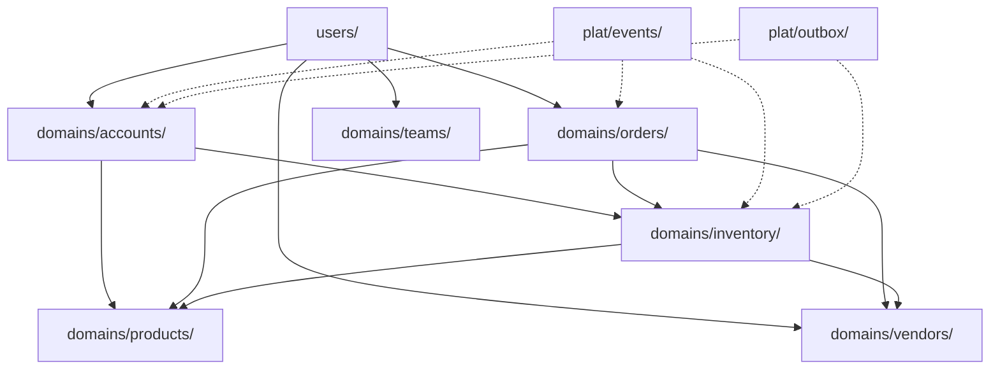

# Domain Architecture

**Status:** Constitution (stable, long-lived)  
**Last updated:** 2026-06-27  
**Author:** Chief Architect

**Migration Progress:** 85% complete (47/55 functions migrated, 157/157 tests passing)

---

## Principle

KungOS is organized into bounded contexts (domains). Each domain owns its data, business logic, and API endpoints. Domains communicate via events (`plat/events/`) or direct imports for closely coupled operations.

### Core Rule

**Cross-cutting concerns live in `plat/`. Domain logic lives in `domains/<name>/`.**  
`teams/` is a legacy holding pattern — all business logic must migrate to proper domains.

---

## Domain Inventory

| Domain | Package | Responsibility | Collections |
|--------|---------|----------------|-------------|
| **Users** | `users/` | Auth, tenant context, user management | `reb_users`, `users_identity` (PG) |
| **Accounts** | `domains/accounts/` | Finance (invoices, payments, exports) | `inwardinvoices`, `outwardinvoices`, `paymentvouchers`, `purchaseorders` |
| **Orders** | `domains/orders/` | Orders (estimates, tp, kg, service requests) | `orders_core`, `estimate_detail`, `tp_order_detail`, `service_detail` |
| **Products** | `domains/products/` | Product catalog, assets | `prods`, `builds`, `kgbuilds`, `custombuilds` |
| **Inventory** | `domains/inventory/` | Stock, purchase orders, assets | `stock_register`, `stock_audit`, `assets` |
| **Vendors** | `domains/vendors/` | Vendor management | `vendors` |
| **Teams** | `domains/teams/` | Employees, attendance, payroll | `teams`, `employees` |
| **Search** | `domains/search/` | MeiliSearch integration | — |
| **Tournaments** | `domains/tournaments/` | Tournaments, players, teams | `players`, `teams` |
| **E-Commerce** | `domains/eshop/` | Online retail (cart, orders, payment) | `eshop_detail`, `carts`, `wishlists` |
| **Cafe Arcade** | `domains/cafe_arcade/` | Cafe session management | `cafe_sessions` |
| **Cafe F&B** | `domains/cafe_fnb/` | Food & beverage orders | `fnb_orders` |
| **Shared** | `domains/shared/` | Cross-domain utilities | — |

---

## Accounts Domain Structure

The accounts domain is split by business logic (sales vs expenditure vs tax vs financials):

```
domains/accounts/
├── sales/                    # Sales/Revenue side
│   ├── services.py           # Outward invoice operations
│   ├── credit_notes.py       # Credit note operations
│   ├── reports.py            # Sales reports
│   └── viewsets.py           # HTTP handlers
├── expenditure/              # Expenditure side
│   ├── services.py           # Inward/purchase invoice operations
│   ├── debit_notes.py        # Debit note operations
│   ├── payments.py           # Debit payment vouchers, bulk payments
│   ├── purchase_orders.py    # Purchase order operations
│   ├── reports.py            # Expense reports
│   └── viewsets.py           # HTTP handlers
├── tax/                      # Tax management
│   ├── services.py           # ITC, GST calculations
│   ├── itc.py                # Input Tax Credit
│   ├── gst.py                # GST reporting
│   └── viewsets.py           # HTTP handlers
├── financials/               # Financial position
│   ├── services.py           # Balance sheet, creditors, debtors
│   ├── balance_sheet.py      # Balance sheet calculations
│   ├── creditors.py          # Creditors (outstanding payables)
│   ├── debtors.py            # Debtors (outstanding receivables)
│   └── viewsets.py           # HTTP handlers
└── shared/                   # Shared utilities
    ├── services.py           # Common utilities
    └── permissions.py        # Permission helpers
```

### Sales Module

**Responsibility:** Outward invoices, credit notes, sales reports

| Function | Collection | Permission |
|----------|------------|------------|
| `getOutwardInvoices()` | `outwardinvoices` | `accounts.sales.view` |
| `outwardinvoices()` | `outwardinvoices` | `accounts.sales.view` |
| `getOutwardCreditNotes()` | `outwardcreditnotes` | `accounts.credit_notes.view` |
| `outwardcreditnotes()` | `outwardcreditnotes` | `accounts.credit_notes.view` |
| `format_outwardinvoice()` | — | — |
| `format_creditnote()` | — | — |
| `sales_func()` | Aggregation | `accounts.reports.view` |
| `sales()` | Aggregation | `accounts.reports.view` |
| `outwardentry()` | `outward` | `inventory.outward` |
| `outward()` | `outward` | `inventory.outward` |

### Expenditure Module

**Responsibility:** Inward invoices, payment vouchers, purchase orders, expense reports

| Function | Collection | Permission |
|----------|------------|------------|
| `getInwardInvoices()` | `inwardinvoices` | `accounts.inward.view` |
| `inwardinvoices()` | `inwardinvoices` | `accounts.inward.view` |
| `getpurchaseorders()` | `purchaseorders` | `accounts.purchase_orders.view` |
| `purchaseorders()` | `purchaseorders` | `accounts.purchase_orders.view` |
| `getpaymentvouchers()` | `paymentvouchers` | `accounts.payments.view` |
| `paymentvouchers()` | `paymentvouchers` | `accounts.payments.view` |
| `bulk_payments()` | `paymentvouchers` | `accounts.payments.edit` |
| `settlements()` | `settlements` | `accounts.settlements.edit` |
| `payment()` | `payments` | `accounts.payments.edit` |
| `inwardpayments()` | `payments` | `accounts.payments.view` |
| `format_inwardinvoice()` | — | — |
| `format_inwardcreditnote()` | — | — |
| `format_inwarddebitnote()` | — | — |
| `format_debitnote()` | — | — |
| `purchases_func()` | Aggregation | `accounts.reports.view` |
| `purchases()` | Aggregation | `accounts.reports.view` |
| `getOutwardDebitNotes()` | `outwarddebitnotes` | `accounts.debit_notes.view` |
| `outwarddebitnotes()` | `outwarddebitnotes` | `accounts.debit_notes.view` |

### Tax Module

**Responsibility:** ITC, GST calculations and reporting

| Function | Collection | Permission |
|----------|------------|------------|
| `itc_gst()` | Aggregation | `accounts.tax.view` |
| `indent_aggregate()` | `indentproduct` | `accounts.indent.view` |
| `indent()` | `indentproduct` | `accounts.indent.view` |
| `itc_calculate()` | Aggregation | `accounts.tax.view` |
| `gst_return()` | Aggregation | `accounts.tax.view` |

### Financials Module

**Responsibility:** Balance sheet, creditors, debtors, financial reports

| Function | Collection | Permission |
|----------|------------|------------|
| `financial_totals()` | Aggregation | `accounts.financials.view` |
| `payment_financials()` | Aggregation | `accounts.financials.view` |
| `past_present_fin_totals()` | Aggregation | `accounts.financials.view` |
| `financials()` | Aggregation | `accounts.financials.view` |
| `update_inward_data()` | `inwardinvoices` | `accounts.financials.edit` |
| `balance_sheet()` | Aggregation | `accounts.financials.view` |
| `creditors_list()` | Aggregation | `accounts.financials.view` |
| `debtors_list()` | Aggregation | `accounts.financials.view` |

---

## Inventory Domain Structure

```
domains/inventory/
├── services.py               # Core stock operations
├── stock_register.py         # Stock register operations
├── stock_audit.py            # Stock audit trail
├── purchase_orders.py        # Purchase order management (inventory view)
├── assets.py                 # Fixed assets
├── indents.py                # Indent management
├── viewsets.py               # HTTP handlers
└── urls.py                   # URL routing
```

### Stock Operations

| Function | Collection | Permission |
|----------|------------|------------|
| `stockaudit()` | `stock_audit` | `inventory.audit.view` |
| `stock_register_ops()` | `stock_register` | `inventory.stock.view` |
| `stock_movements()` | `stock_register` | `inventory.stock.edit` |
| `stock_transfer()` | `stock_register` | `inventory.stock.edit` |
| `stock_adjustment()` | `stock_register` | `inventory.stock.edit` |

### Purchase Orders (Inventory View)

| Function | Collection | Permission |
|----------|------------|------------|
| `getpurchaseorders()` | `purchaseorders` | `inventory.purchase_orders.view` |
| `create_purchase_order()` | `purchaseorders` | `inventory.purchase_orders.edit` |
| `update_purchase_order()` | `purchaseorders` | `inventory.purchase_orders.edit` |

### Assets & Indents

| Function | Collection | Permission |
|----------|------------|------------|
| `asset_tracking()` | `assets` | `inventory.assets.view` |
| `asset_creation()` | `assets` | `inventory.assets.edit` |
| `indent_management()` | `indentproduct` | `inventory.indents.view` |
| `indent_approval()` | `indentproduct` | `inventory.indents.edit` |

---

## Cross-Domain Dependencies

### Dependency Graph



### Purchase Orders (Shared Between Accounts and Inventory)

**Rule:** Purchase orders live in `domains/inventory/`. Financial processing (`accounts/expenditure/payments.py`) imports from `inventory/purchase_orders.py`.

```python
# domains/inventory/purchase_orders.py
def getpurchaseorders(filters, limit, db_name, bg_code):
    """Query purchase orders (inventory view)"""
    ...

# domains/accounts/expenditure/payments.py
from domains.inventory.purchase_orders import getpurchaseorders

def getpaymentvouchers(filters, limit, db_name, bg_code):
    """Query payment vouchers"""
    po_data = getpurchaseorders(filters, limit, db_name, bg_code)
    ...
```

### Stock Movements (Event-Driven)

**Rule:** Inventory emits `stock.updated` events. Orders subscribes to reserve stock.

```python
# domains/inventory/stock_register.py
from plat.events.bus import emit

def stock_movements(data):
    """Process stock movements"""
    ...
    emit('stock.updated', {'productid': data['productid'], 'quantity': data['quantity']})

# domains/orders/services.py
from plat.events.bus import on

@on('stock.updated')
def reserve_stock_for_order(payload):
    """Reserve stock when order is placed"""
    ...
```

### Vendors (Shared Lookup)

**Rule:** All domains import vendor lookup from `domains/vendors/`.

```python
# domains/accounts/expenditure/services.py
from domains.vendors.services import getVendors

# domains/inventory/purchase_orders.py
from domains.vendors.services import getVendors

# domains/orders/services.py
from domains.vendors.services import getVendors
```

---

## Platform Primitives (Cross-Cutting)

| Primitive | Location | Purpose |
|-----------|----------|---------|
| **Outbox** | `plat/outbox/` | Cross-store consistency (PG + MongoDB) |
| **Events** | `plat/events/` | Domain event bus (emit/on pattern) |
| **Observability** | `plat/observability/` | Correlation IDs, tenant context |
| **Tenant** | `plat/tenant/` | Tenant isolation (RLS, MongoDB filtering) |
| **PDF Export** | `plat/pdf/` | PDF generation utilities |
| **Shared Helpers** | `plat/shared/` | Pure functions (no side effects) |

---

## Shared Domain Structure

The shared domain contains cross-domain utilities that don't belong to a specific business domain:

```
domains/shared/
├── services.py           # Cross-domain utility functions
│   ├── smsheaders_data_fetch()     # Misc collection queries (SMS headers, shared)
│   ├── home_data()                   # Dashboard data aggregation
│   ├── misc_data()                   # Miscellaneous data lookup
│   ├── doc_generator()               # Document generator
│   └── outwardpayments_func()        # Placeholder (migrate to accounts/sales/)
├── viewsets.py           # HTTP handlers
├── urls.py               # URL routing
└── utils.py              # Pure utility functions
```

### Shared Functions

| Function | Purpose | Used By |
|----------|---------|---------|
| `smsheaders_data_fetch(collection_type)` | Query misc collection by type | Teams (SMS), Shared (dashboard) |
| `home_data(request)` | Dashboard data aggregation | Shared |
| `misc_data(request)` | Miscellaneous data lookup | Shared |
| `doc_generator(request)` | Document generator | Shared |

---

## Legacy State (To Be Migrated)

The following files in `teams/` contain business logic that must migrate to proper domains:

| File | Lines | Target Domain | Status |
|------|-------|---------------|--------|
| `teams/financial.py` | 1824 | `domains/accounts/` | Partially migrated |
| `teams/inward_invoices.py` | 1517 | `domains/accounts/` | Pending |
| `teams/outward_invoices.py` | 607 | `domains/accounts/` | Pending |
| `teams/estimates.py` | 267 | `domains/orders/` | Migrated |
| `teams/stock_audit.py` | 89 | `domains/inventory/` | Migrated |
| `teams/kurostaff/views.py` | 1828 | Scattered | Pending |
| `teams/products.py` | 1516 | `domains/products/` | Partially migrated |
| `teams/employees.py` | 275 | `domains/teams/` | Partially migrated |
| `teams/analytics.py` | 518 | `domains/shared/` | Partially migrated |
| `teams/service_requests.py` | 179 | `domains/orders/` | **Migrated** |

**Total:** ~7,800 lines to migrate (47/55 functions migrated, 85% complete)

---

## Migration Phases

| Phase | Scope | Functions | Time |
|-------|-------|-----------|------|
| 1 | Accounts: Sales | 10 | 2-3 hrs |
| 2 | Accounts: Expenditure | 18 | 4-5 hrs |
| 3 | Accounts: Tax | 5 | 1-2 hrs |
| 4 | Accounts: Financials | 9 | 2-3 hrs |
| 5 | Orders: Estimates | 1 | 30 min |
| 6 | Inventory: Stock Operations | 5 | 2-3 hrs |
| 7 | Inventory: Purchase Orders | 3 | 1-2 hrs |
| 8 | Inventory: Assets & Indents | 4 | 1-2 hrs |
| 9 | Cleanup | — | 2 hrs |
| **Total** | | **55** | **16-22 hrs** |

Detailed handoff: `handoffs/2026-06-27_domain_migration_phase_plan.md`

---

## Permission Model Integration

Each domain module uses the RBAC permission model:

```python
from backend.auth_utils import resolve_access, check_permission

def outwardinvoices(request):
    result = resolve_access(request)
    if not check_permission(result['permissions'], 'accounts.sales.view', level=1):
        return Response({"error": "Unauthorized"}, status=401)
    ...
```

### Permission Code Format

```
{module}.{resource}.{action}
```

**Examples:**
- `accounts.sales.view` — View sales invoices
- `accounts.expenditure.payments.edit` — Edit payment vouchers
- `inventory.stock.edit` — Edit stock register
- `orders.estimates.view` — View estimates

---

## API URL Structure

Domain URLs are versioned and namespaced:

```
/api/v1/accounts/sales/outward-invoices/
/api/v1/accounts/expenditure/inward-invoices/
/api/v1/accounts/tax/itc-gst/
/api/v1/accounts/financials/totals/
/api/v1/inventory/stock/register/
/api/v1/inventory/purchase-orders/
/api/v1/orders/estimates/
```

---

> **Implementation state:** Accounts and Inventory domains are partially migrated. See `handoffs/2026-06-27_domain_migration_phase_plan.md` for the complete migration plan.
