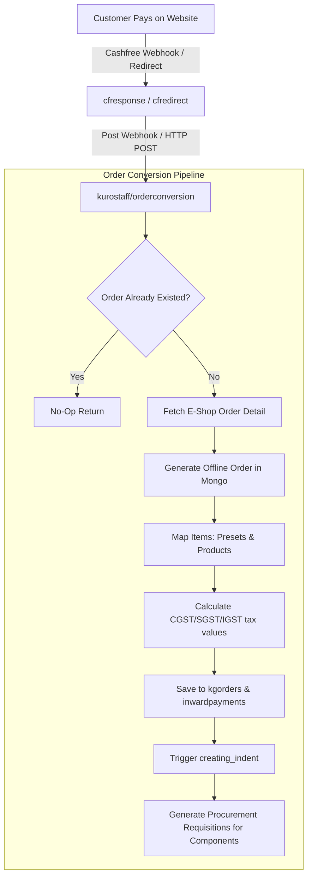

# Legacy E-Commerce (E-Shop) Reconciliation & Review

**Status:** Draft (Approved for Integration Prep)  
**Date:** 2026-05-17  
**Author:** Antigravity (Principal AI Architect)  
**Source Path:** `/home/chief/Coding-Projects/kuro-gaming-dj-backend`  
**Tags:** [ecommerce, migration, integration, payment, cashfree]

---

## 1. Executive Summary

This review provides a deep architectural breakdown of the legacy **Kuro Gaming E-Commerce (E-Shop)** codebase (`kuro-gaming-dj-backend`) to ensure that no business logic, custom payment adapters, or cross-system workflows are missed when migrating to **KungOS**.

### Key Findings
1. **Critical Custom PC Build Duplication:** The catalog relies on a dynamic cloning mechanism for Custom PC Builds (`"KCPB"` product prefixes). Every ordered build is cloned to an immutable record in MongoDB `custombuilds` to preserve ordered hardware specifications historically.
2. **Double-Write Procurement Bridge:** Paid e-commerce orders are dynamically converted into offline enterprise orders via an `/api/v1/kurostaff/orderconversion` bridge. This bridge **automatically creates procurement indents** (`indentproduct` collection) for all PC components in the warehouse.
3. **Address Immutable Clone Pattern:** To protect tax and financial audit trails, addresses attached to placed orders are marked as immutable. Any edit triggers a clone-and-decommission flow rather than an in-place update.
4. **Local Base64 UPI QR Generation:** The checkout generates dynamic UPI QR Codes locally using `pyqrcode` and pipes them as Base64 PNGs directly to the frontend for checkout.

---

## 2. E-Commerce Core Domain Map

The table below lists all legacy e-commerce apps and their exact operational logic:

| Legacy App | Model/Component | Database Store | Key Rules & Dynamic Actions |
| :--- | :--- | :--- | :--- |
| **`accounts`** | `Cart`, `Wishlist` | PostgreSQL | Simple string bindings for `productid` and `category` (due to Mongo catalog storage). |
| **`accounts`** | `Addresslist` | PostgreSQL | **Immutable Address Edit Pattern:** If an address has `is_used = True`, editing it marks the old one as `delete_flag = True` and inserts a **new cloned record** to protect old order invoices. |
| **`orders`** | `Orders`, `OrderItems` | PostgreSQL | **PC Cabinet Shipping Surcharge:** Adds Rs. 500 flat shipping * quantity if item is a "tower" (Cabinet). <br>**Cashfree Surcharge:** Adds 2% flat processing fee to total if payment is Cashfree. |
| **`orders`** | Custom PC cloning | Mongo (`custombuilds`) | If order item contains prefix `"KCPB"`, it copies the record in `custombuilds` Mongo collection, marks the copy `used = True`, sets a sequential ID (`"KCPB24" + 8-digit seq`), and links the order item to the copy. |
| **`payment`** | Cashfree PG Integrator | API Gateway | Uses sandbox (`sandbox.cashfree.com`) and prod (`api.cashfree.com`) APIs. Verifies payments via webhook notifications (`cfresponse`) and return URLs (`cfredirect`). |
| **`payment`** | UPI QR Engine | Local Code | Generates local dynamic UPI strings (`upi://pay?pa=BHARATPE...`) and renders them to Base64 PNG streams using `pyqrcode`. |
| **`orders`** | Deprecate & Recover | PostgreSQL | If customer alters payment options at checkout, old order is marked deleted, and items are **automatically re-populated** back into their cart so their cart isn't lost. |

---

## 3. The Order Conversion Pipeline (Enterprise Bridge)

When an online checkout completes successfully via Cashfree, a background webhook is triggered to our internal `orderconversion` endpoint in the enterprise billing panel.



### The Procurement Gap
* **The Flow (`teams/kurostaff/views.py` line 2787):** When `orderconversion` runs, it fetches online order data, maps items, inserts records into the shared `kgorders` and `inwardpayments` collections, and runs `creating_indent()`.
* **The Risk:** This process operates entirely on MongoDB. If the e-commerce customer's PG database updates, but the webhook to MongoDB fails, the order is confirmed online but **the warehouse receives no procurement indent request** to purchase the hardware.
* **Remediation for KungOS:** Integrate the `orderconversion` pipeline directly with the `plat/outbox/` system so that order payment triggers a durable outbox event (`order.payment_verified`) which is processed reliably.

---

## 4. Specific Integration Blueprint for KungOS

To import these modules safely into **KungOS** without regression, we must follow these guidelines:

### 4.1 Address Profile Transition
* Address storage must link directly to the new `users_identity` table (under a new `users_address` model), rather than being bound to `CustomUser`.
* Preserve the **Immutable Address Edit Pattern** (cloning `is_used` addresses) to protect tax invoicing integrity.

### 4.2 Outbox-Driven Custom PC Copying
* The dynamic custom build copying logic (`"KCPB"` prefixes) must be executed inside a PG transaction using `transaction.on_commit` or an outbox event processor. This prevents PyMongo from inserting ghost custom builds when PG transactions roll back.

### 4.3 QR Code Engine Standardization
* Keep the dynamic UPI QR PNG generator. It is highly local and robust, minimizing discrete third-party API dependencies (aligned with local-first stack rules).

### 4.4 Webhook Signature Verification
* Currently, `payment/views.py` lacks strict HMAC signature validation for the incoming Cashfree notify webhook (`cfresponse`). This is a security risk (webhook spoofing). 
* **Remediation:** Implement HMAC-SHA256 verification using the Cashfree client secret:
  ```python
  import hmac
  import hashlib
  import base64

  def verify_cashfree_signature(payload_string, signature, secret_key):
      computed = base64.b64encode(
          hmac.new(secret_key.encode('utf-8'), payload_string.encode('utf-8'), hashlib.sha256).digest()
      ).decode('utf-8')
      return hmac.compare_digest(computed, signature)
  ```

---

*This review serves as the official blueprint for integrating the Kuro Gaming legacy e-commerce platform into KungOS. Any modifications must be recorded in global and local wikis.*
