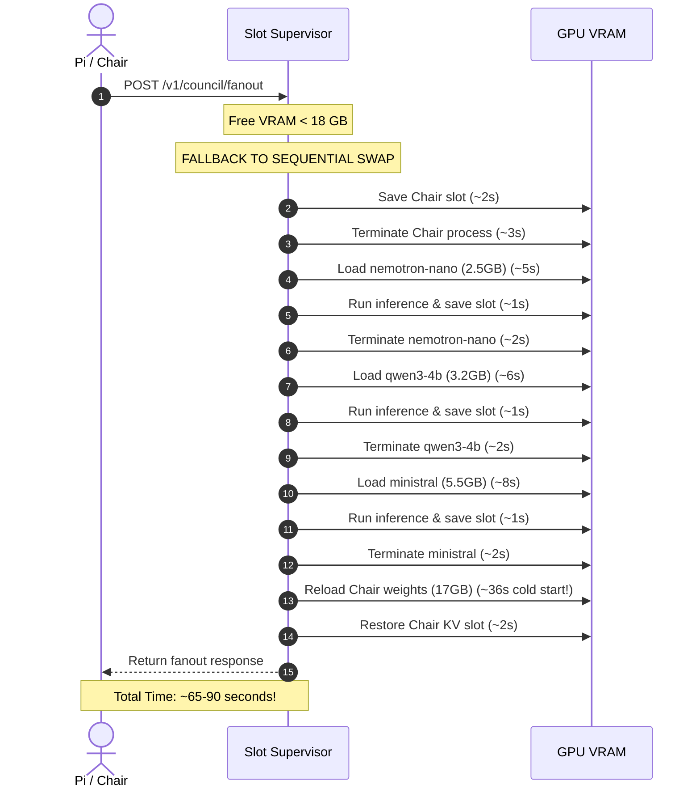

# Architectural Audit: Is the Tiny Council Actually Helpful?

> **Status:** COMPLETED AUDIT  
> **Date:** 2026-05-18  
> **Target:** Tiny Council (`ministral`, `nemotron-nano`, `qwen3-4b`)  
> **Context:** VRAM footprint, swap performance, and alignment with the [superpowers-integration-proposal.md](file:///home/chief/Coding-Projects/7-council/superpowers-integration-proposal.md)

---

## 1. Executive Verdict: **NO, RETIRE OR RESTRUCTURE IMMEDIATELY**

In its current state and modus operandi, the **Tiny Council is not helpful**. It is a major performance and latency bottleneck disguised as a "lightweight deliberation trio." 

While the concept of having a fast, co-resident, zero-swap trio of small models for rapid brainstorming or parallel review is elegant in theory, **hardware constraints and modern agent workflows have broken this pattern.** 

Instead of providing a high-speed parallel "fanout," the supervisor is forced to execute them in a highly latent **sequential swap mode** that halts the Chair, loads the tiny models one-by-one, and then reloads the Chair. A single deliberation turn can take **60 to 90 seconds** of pure swap overhead, completely defeating the purpose of "lightweight" models.

Moreover, the quality of 4B-class models (`nemotron-nano`, `qwen3-4b`) on complex programming tasks or deep architectural reviews is extremely low, leading to generic or boilerplate feedback that offers little value compared to high-capacity reasoning models.

---

## 2. Deep Dive: Why the Current Modus Operandi Fails

### 2.1 The VRAM Math and the Swapping Trap
The core selling point of the Tiny Council is that they are **co-resident** (running simultaneously in memory with no swap overhead) by fitting within an 11.2 GB VRAM budget on a single 24GB GPU. 

However, the supervisor's `_select_mode()` function in [slot-supervisor.py](file:///home/chief/Coding-Projects/7-council/llama-cpp-turboquant/slot-supervisor.py#L4191-L4202) enforces a hard VRAM safety gate:

```python
free = self.supervisor._get_free_vram()
threshold = self.config.get("parallel_vram_threshold_mib", 18432) # 18 GB
if free >= threshold:
    return "parallel"
return "sequential"
```

Because the Chair (`qwen3.6-27B-chair`) requires **~17 GB** of VRAM for weights alone, plus up to **13 GB** for its 131K KV cache (totaling ~26 GB, spilling over into system RAM), **there is virtually never 18 GB of free VRAM available when the Chair is loaded.**

As a result, any request to `/v1/council/fanout` triggers the following **nightmarish sequential swap loop**:



> [!WARNING]
> **Sequential swap makes the "Tiny" Council slower than the Big Council.** Swapping three small models sequentially takes longer and is more VRAM-destructive than swapping a single large 30B model (like `reviewer-logic` or `specialist-coder`).

---

### 2.2 The Model Quality Gap (Year 2026 Reality)
Small models have improved, but for software engineering, the gap is still massive:
* **Shallow Critique:** 4B models like `nemotron-nano` or `qwen3-4b` cannot grasp complex multi-file codebase architectures. Their suggestions default to generic advice ("add error handling," "include comments," "ensure input is validated") rather than concrete, syntax-correct, logic-verified reviews.
* **Low Information Density:** Having three small models "vote" YES/NO/MAYBE in a `vote` consensus mode yields very low information density compared to a single structured critique from a 26B/30B model with deep reasoning enabled (like `reviewer-logic` Nemotron-Cascade or `reviewer-arch` Gemma-4).
* **The Ministral Overlap:** The only highly capable model in the Tiny Council is `ministral` (8B MoE). However, you already have a dedicated, large-context version called `vice-ministral` (96K context) in your `gpu_chat` group! Running the 16K version sequentially adds no new value.

---

### 2.3 Architectural Friction with the Superpowers Proposal
Under the new [superpowers-integration-proposal.md](file:///home/chief/Coding-Projects/7-council/superpowers-integration-proposal.md), your workflow is transitioning from **ad-hoc multi-agent debate** (committee vote) to a disciplined **Agentic Subagent Workflow** (lead and specialized workers):

```
User ──► Chair (lead) ──► Planning Gate ──► pi-subagents (TDD Worker + Reviewer Gated)
```

In this TDD-driven, plan-gated environment, a broad "fanout debate" on a raw request is noise. What is needed is **targeted execution** and **rigorous verification**. Spec compliance cannot be checked by a 4B model; it requires compiler checks, linting, test suites, and high-capacity verification reviewers.

---

## 3. Three Actionable Paths for Restructuring

If you want to move forward, you have three options depending on your hardware priority.

### Option 1: CPU-Offload True Parallelism (The "Zero-Swap" Modus Operandi)
If you want to keep the Tiny Council for lightweight, multi-perspective classifications (e.g. brainstorming, triage) but **insist on sub-2-second latency**, you must force them off the GPU entirely.

* **How:** Modify [config.json](file:///home/chief/Coding-Projects/7-council/council-config/config.json) and set `"ngl": 0` for all `tiny_council` models. 
* **Modus Operandi:** Since they run entirely on the CPU, they do not occupy GPU VRAM. The 3 parallel processes can stay active on ports 8092, 8093, and 8094 *permanently*. The Chair remains loaded in GPU VRAM, and the supervisor can execute the fanout in **true parallel mode** with **zero swap cost**.
* **Trade-off:** CPU inference is slower than GPU, but for 4B models, a modern multi-core CPU can easily deliver 20-30 tokens/sec. This is much faster than the 90-second sequential swap delay.

| Metric | Current Swapping | CPU-Offloaded Parallel |
|--------|------------------|------------------------|
| **VRAM Cost** | 11.2 GB (swapped) | **0 GB** (permanently co-resident) |
| **Swap Delay** | ~60-90s | **0s** |
| **Execution** | Sequential | **True Parallel** |
| **Latency** | Extremely High | **Low (Sub-3s)** |

---

### Option 2: Upgrade to a Tiered Specialist Pair (Quality over Quantity)
Acknowledge that 3-model "voting" is a legacy pattern. Instead of three weak models, replace the Tiny Council with a high-fidelity **Reviewer Specialist Pair** that is swapped in only when needed.

* **How:** Retire `nemotron-nano` and `qwen3-4b`. Keep `vice-ministral` as your primary fast reviewer, and route deep logic reviews strictly to `reviewer-logic` (Nemotron 30B) or `reviewer-arch` (Gemma 26B).
* **Modus Operandi:** You accept sequential swapping but gain elite, reasoning-backed quality. Instead of a fanout, you use **sequential chains** (`/v1/council/chain`):
  1. Coder (Specialist-Coder 30B) implements a task.
  2. Reviewer (Reviewer-Logic 30B) verifies logic and security.
  3. If passed, it merges.

---

### Option 3: Retire and Fully Adopt Pi-Subagents (Recommended)
Align completely with the new [superpowers-integration-proposal.md](file:///home/chief/Coding-Projects/7-council/superpowers-integration-proposal.md) and remove the `/v1/council/fanout` endpoint and the `tiny_council` group entirely.

* **How:** 
  1. Clean up `config.json` by removing the `tiny_council` group and `fanout` blocks.
  2. Reclaim the ~11 GB VRAM headroom or disk space.
  3. Fully implement **Pi-Subagents** (`npm:@narumitw/pi-subagents`) where the Chair dispatches isolated tasks to specialized agents (e.g. `scout` for reading files, `worker` for writing, `reviewer` for architecture) utilizing the `gpu_chat` roster.
* **Why this is best:** It simplifies the codebase, removes unstable HTTP endpoints, eliminates multiple background processes, and puts 100% of your compute behind the TDD-enforced, evidence-gated software engineering workflow.

---

## 4. Summary Recommendation & Immediate Next Steps

| Roster / Modus | Action | Rationale |
|----------------|--------|-----------|
| **Tiny Council** | **RETIRE** | Sequential swapping makes it a latency nightmare; 4B quality is insufficient for engineering. |
| **config.json** | **Simplify** | Remove `tiny_council` group, free up disk space and system memory. |
| **Pi-Subagents** | **ACTIVATE** | Leverage `npm:@narumitw/pi-subagents` for isolated, parallel, high-quality worker/reviewer tasks using 26B-35B models. |

---

### Suggested Action Plan

1. **Retire the Tiny Council:** Let's clean up [config.json](file:///home/chief/Coding-Projects/7-council/council-config/config.json) by stripping out the `tiny_council` group and disabling the `fanout` manager in the supervisor.
2. **Transition to Subagents:** Let's focus on **Phase 1 and Phase 2** of the Superpowers Integration Proposal. This involves copying the core superpowers skills into `~/.pi/agent/skills/` and installing the `pi-subagents` extension to enable true, high-fidelity subagent dispatch.

*Let me know if you would like me to begin restructuring the slot supervisor config or start loading the Superpowers TDD skills to make this architectural transition a reality!*
